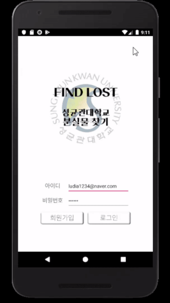

# SKKU_FindLost
성균관대학교 분실물 찾기 앱
2019 Spring MobileAppProgramming

- Android SDK Build-Tools 28.0.3 (build-tools;28.0.3)
- Android SDK Platform 26 (platforms;android-26)

- Firebase
  - Firebase Realtime Database
  - Firebase Cloud Messaging
  - Firebase Cloud Storage

- glide

- sendbird

